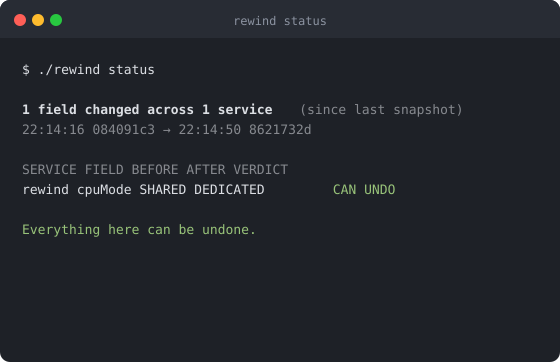
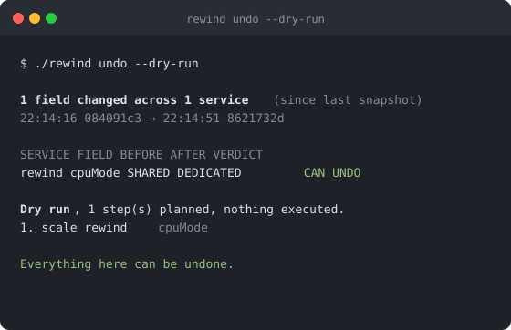
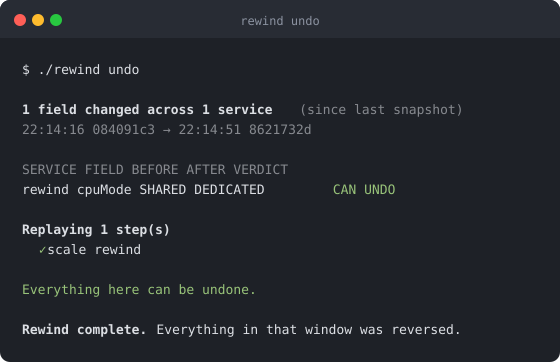
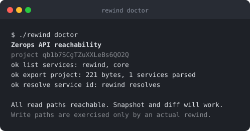

# Rewind

Undo the last twenty minutes of your infrastructure.

<table>
<tr>
<td width="50%"></td>
<td width="50%"></td>
</tr>
<tr>
<td></td>
<td></td>
</tr>
</table>

Real captured output from a live Zerops project. Nothing mocked, nothing typeset by hand.

## The problem

Zerops keeps your last 10 application versions and will roll any of them back on demand.

It keeps zero versions of your **infrastructure** state: the scaling, the environment variables, the public access you changed around them.

That gap matters now, because ZCP hands a coding agent `zerops_scale`, `zerops_env`, `zerops_manage`, and `zerops_subdomain` with no confirmation prompt. Per the [ZCP MCP operations reference](https://docs.zerops.io/zcp/reference/mcp-operations), only `zerops_delete` and destructive `zerops_import` are gated. One agent session can move a dozen infrastructure fields across several services in under thirty seconds, and nothing rolls that back.

Rewind is the missing undo button.

## Running it

```bash
git clone https://github.com/fozagtx/rewind
cd rewind
npm install

zcli login <your-token>
export ZEROPS_PROJECT_ID=<your project id>

./rewind snapshot          # save a restore point
./rewind status            # what changed since then
./rewind undo --dry-run    # show the plan, change nothing
./rewind undo              # put it back
./rewind doctor            # check the Zerops API is reachable
```

Nothing is published to npm. `./rewind` runs the CLI straight from the repo.

Rewind reuses the token `zcli login` already stores, so there is no second credential to manage. Set `ZEROPS_TOKEN` to override it.

Every command works against the most recent restore point. Add `--to 20m` only to reach further back.

## What it refuses to do

```
COULD NOT UNDO, 1 change
Service `worker` was deleted.
  Configuration restored from snapshot. The data it held is gone.
  Deleting a service destroys its volume, and no export contains it.
```

That red panel is the point of the whole tool. A kill switch that stops most of a bad change is worse than one that stops none, because it makes you think you are safe.

* Unknown fields default to **CANNOT_UNDO**. Rewind never claims to reverse a field that no known tool can write.
* Secrets are never stored, so a changed secret is reported as irreversible instead of being quietly restored from a value the tool should not have kept.
* A deleted service gets its configuration rebuilt, and the data loss is still reported, because restoring a config does not restore rows.
* A run reports success only when nothing was left un-reversed.
* The verdict column says whether a change *can* be undone, never that it already was.

## How it works

```
capture  ->  snapshot     immutable, sha256 hashed
compare  ->  changeset    service, field, before, after
judge    ->  verdict      REVERSIBLE
                          REVERSIBLE_WITH_RESTART
                          CANNOT_UNDO plus a plain reason
restore  ->  plan         recreate, scale, env, subdomain, restart
                          then everything it could not fix
```

Scaling changes for one service collapse into a single call. Environment changes trigger exactly one restart per service, ordered last.

## Why this belongs on Zerops

Zerops is not just where Rewind runs. Zerops is what Rewind is about.

On a plain server with docker compose there is no project export to capture, so there is nothing to snapshot. The state is a compose file in git, and git already does diff and revert. There is no ZCP, so there is no unprompted mutation surface for an agent to drift. The mechanism has nothing to point at.

The hosting underneath is ordinary and swappable, and this README will not pretend otherwise.

## Proven against a live project

```
1. ./rewind snapshot        baseline captured
2. cpuMode changed via API  drift, the way an agent causes it
3. ./rewind undo --dry-run  1 step planned, nothing executed
4. ./rewind undo            scale rewind  OK
5. independent API read     cpuMode restored
```

Three real bugs surfaced during those runs, all of the kind a mock would have hidden.

Zerops nests scale fields under `verticalAutoscaling`, so before flattening, a routine scale change was classified `CANNOT_UNDO`. That is the one verdict this tool must never get wrong.

A dry run used to store a snapshot of the drifted state, so the next undo took that as its baseline, compared the mess against itself, and reported nothing to do. The drift stayed and the tool said everything was fine. Dry runs now record nothing, and only snapshots you asked for can be chosen as a restore point.

The third surfaced while capturing the screenshots above: the verdict column read `REVERSED` in `status`, before anything had run. Frozen in a still image, the overclaim was obvious.

## Verified against the docs and the API

Checked against live Zerops documentation on 2026-08-09:

* application rollback keeps the 10 most recent versions, infrastructure state has no equivalent
* `zerops_scale` cannot change HA or NON_HA, which is fixed at service creation
* `corePackage` LIGHT to SERIOUS is one way and partially destructive
* only `zerops_delete` and destructive `zerops_import` carry confirmation gates

Every REST path was probed against a real project. A GET against a write path returns 405 when the route exists and 404 when it does not, which confirmed each one without mutating anything:

```
GET  /project/{id}/export                        200
GET  /project/{id}/service-stack                 200
GET  /service-stack/{id}                         200
GET  /service-stack/{id}/env                     200
PUT  /service-stack/{id}/autoscaling             exists
POST /service-stack/{id}/restart                 exists
POST /service-stack/{id}/enable-subdomain-access exists
POST /process/search                             exists
```

Still unverified: request body shapes for `deleteEnv` and `importServices`. Scale and subdomain were exercised for real. The rest mirror the field names the read endpoints return.

## Tests

```bash
npm test          # 53 tests
npm run typecheck
```

Covers secret redaction, numeric comparison, deterministic ordering, every classification rule, scale call collapsing, step ordering, partial failure handling, both autoscaling nesting shapes, restore point selection, and the rule that a run with anything left un-reversed can never report success.

Screenshots regenerate from real captured runs, never hand-edited:

```bash
node --import tsx scripts/capture-svg.ts <capture.txt> docs/img/<name>.svg "title"
```
